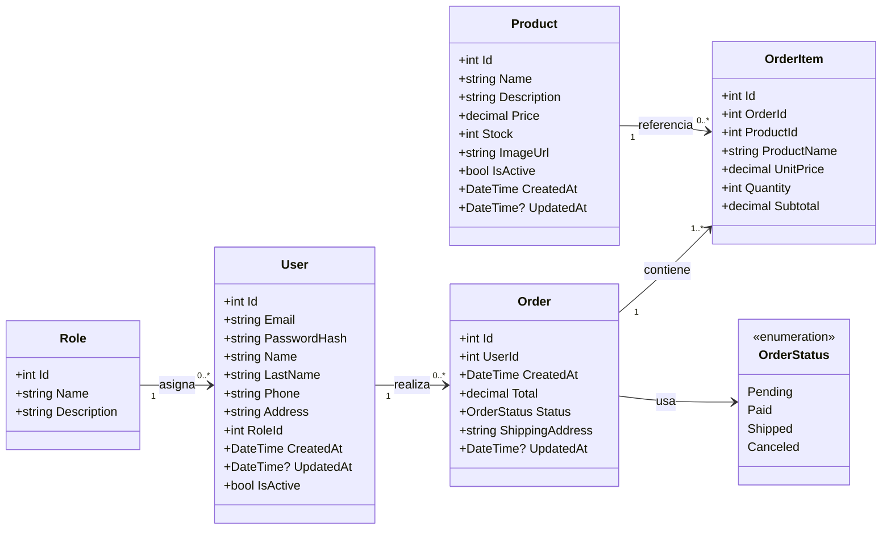
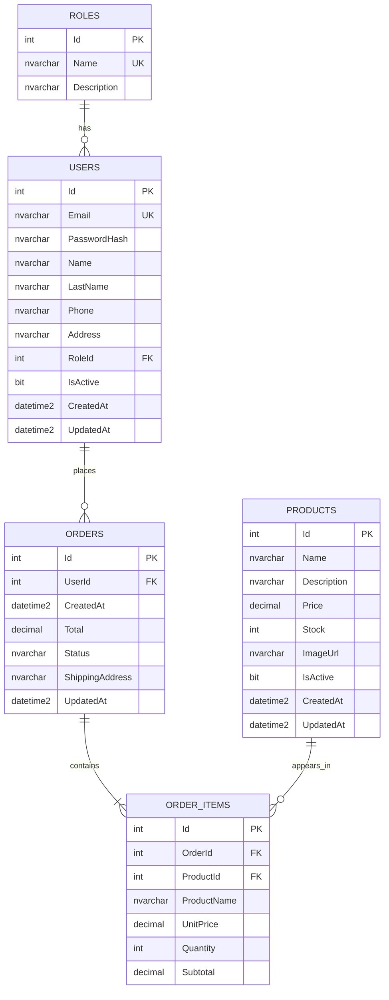
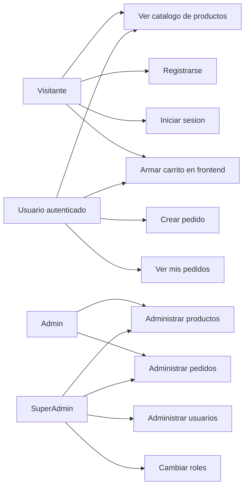

# Backend propuesto - Diagramas y casos de uso

Objetivo: definir el backend destino para la migracion a `.NET Web API` con `SQL Server`, partiendo del sistema actual pero sin conservar datos de prueba.

## 1. Alcance del backend propuesto

El backend propuesto cubre:

- Autenticacion con JWT.
- Gestion de usuarios.
- Gestion de roles.
- Catalogo de productos.
- Gestion de stock.
- Creacion de pedidos.
- Persistencia del detalle de cada pedido.
- Administracion de pedidos.

La propuesta corrige una limitacion del backend actual: los pedidos deben guardar sus items en una tabla propia (`OrderItems`) para conservar el historico de productos, cantidades y precios al momento de compra.

## 2. Modelo de dominio

Entidades principales:

- `User`
- `Role`
- `Product`
- `Order`
- `OrderItem`

Enums sugeridos:

- `OrderStatus`

Roles base:

- `User`
- `Admin`
- `SuperAdmin`

Estados de pedido:

- `Pending`
- `Paid`
- `Shipped`
- `Canceled`

## 3. Diagrama de clases



### Notas del modelo

- `User.PasswordHash` nunca debe exponer la password original.
- `Product.Price` debe ser `decimal`, no `int`, para evitar errores con dinero.
- `OrderItem.ProductName` y `OrderItem.UnitPrice` se guardan como snapshot del momento de compra. Asi, si luego cambia el producto, la orden historica conserva sus datos originales.
- `Product.IsActive` permite baja logica de productos, mas segura que borrar productos usados en pedidos.
- `User.IsActive` permite desactivar cuentas sin romper historiales.

## 4. DER propuesto



## 5. Tablas SQL Server sugeridas

### Roles

| Campo | Tipo | Restricciones |
| --- | --- | --- |
| Id | int | PK, identity |
| Name | nvarchar(50) | not null, unique |
| Description | nvarchar(200) | null |

Valores iniciales:

- `User`
- `Admin`
- `SuperAdmin`

### Users

| Campo | Tipo | Restricciones |
| --- | --- | --- |
| Id | int | PK, identity |
| Email | nvarchar(256) | not null, unique |
| PasswordHash | nvarchar(500) | not null |
| Name | nvarchar(100) | not null |
| LastName | nvarchar(100) | null |
| Phone | nvarchar(50) | null |
| Address | nvarchar(300) | null |
| RoleId | int | FK Roles(Id), not null |
| IsActive | bit | not null |
| CreatedAt | datetime2 | not null |
| UpdatedAt | datetime2 | null |

### Products

| Campo | Tipo | Restricciones |
| --- | --- | --- |
| Id | int | PK, identity |
| Name | nvarchar(150) | not null |
| Description | nvarchar(1000) | null |
| Price | decimal(18,2) | not null, mayor a 0 |
| Stock | int | not null, mayor o igual a 0 |
| ImageUrl | nvarchar(500) | null |
| IsActive | bit | not null |
| CreatedAt | datetime2 | not null |
| UpdatedAt | datetime2 | null |

### Orders

| Campo | Tipo | Restricciones |
| --- | --- | --- |
| Id | int | PK, identity |
| UserId | int | FK Users(Id), not null |
| CreatedAt | datetime2 | not null |
| Total | decimal(18,2) | not null |
| Status | nvarchar(30) | not null |
| ShippingAddress | nvarchar(300) | not null |
| UpdatedAt | datetime2 | null |

### OrderItems

| Campo | Tipo | Restricciones |
| --- | --- | --- |
| Id | int | PK, identity |
| OrderId | int | FK Orders(Id), not null |
| ProductId | int | FK Products(Id), not null |
| ProductName | nvarchar(150) | not null |
| UnitPrice | decimal(18,2) | not null |
| Quantity | int | not null, mayor a 0 |
| Subtotal | decimal(18,2) | not null |

## 6. Diagrama de casos de uso



## 7. Casos de uso detallados

### CU-01 - Registrarse

Actor principal: visitante.

Precondiciones:

- El email no debe existir en el sistema.

Flujo principal:

1. El visitante envia nombre, email y password.
2. El backend valida campos obligatorios.
3. El backend verifica que el email no exista.
4. El backend hashea la password.
5. El backend crea el usuario con rol `User`.
6. El backend devuelve JWT y datos publicos del usuario.

Resultado:

- Usuario creado y autenticado.

### CU-02 - Iniciar sesion

Actor principal: visitante.

Precondiciones:

- El usuario existe y esta activo.

Flujo principal:

1. El visitante envia email y password.
2. El backend busca el usuario por email.
3. El backend compara la password con el hash.
4. El backend genera un JWT con id, email y rol.
5. El backend devuelve token y usuario.

Resultado:

- Usuario autenticado.

### CU-03 - Ver catalogo

Actor principal: visitante o usuario autenticado.

Flujo principal:

1. El cliente solicita productos.
2. El backend devuelve productos activos.
3. El frontend muestra nombre, descripcion, precio, stock e imagen.

Resultado:

- Catalogo visible.

### CU-04 - Crear pedido

Actor principal: usuario autenticado.

Precondiciones:

- El usuario tiene JWT valido.
- El carrito tiene al menos un item.
- Los productos existen, estan activos y tienen stock suficiente.

Flujo principal:

1. El usuario confirma checkout con direccion de envio e items.
2. El backend valida direccion e items.
3. El backend consulta productos desde SQL Server.
4. El backend calcula el total usando precios actuales del backend.
5. El backend inicia una transaccion.
6. El backend crea la orden con estado `Pending`.
7. El backend crea los `OrderItems`.
8. El backend descuenta stock.
9. El backend confirma la transaccion.
10. El backend devuelve id de orden y total.

Resultado:

- Pedido creado con detalle persistido.
- Stock actualizado.

Reglas:

- El precio enviado por el frontend no se toma como fuente de verdad.
- Si cualquier producto no existe o no tiene stock, no se crea la orden.

### CU-05 - Ver mis pedidos

Actor principal: usuario autenticado.

Flujo principal:

1. El usuario solicita sus pedidos.
2. El backend identifica al usuario desde el JWT.
3. El backend devuelve solo pedidos pertenecientes a ese usuario.

Resultado:

- Historial personal visible.

### CU-06 - Administrar productos

Actor principal: admin o super-admin.

Operaciones:

- Crear producto.
- Editar producto.
- Activar/desactivar producto.
- Ajustar stock.

Reglas:

- No se recomienda borrar fisicamente productos que ya aparezcan en pedidos.
- Para productos fuera de venta, usar `IsActive = false`.

### CU-07 - Administrar pedidos

Actor principal: admin o super-admin.

Operaciones:

- Listar pedidos.
- Ver detalle de pedido.
- Cambiar estado.
- Cancelar pedido.

Estados validos:

- `Pending`
- `Paid`
- `Shipped`
- `Canceled`

Regla sugerida:

- La cancelacion deberia definir si repone stock o no. Recomendacion inicial: si se cancela desde `Pending`, reponer stock; si se cancela luego de `Paid` o `Shipped`, tratarlo como proceso administrativo separado.

### CU-08 - Administrar usuarios

Actor principal: super-admin.

Operaciones:

- Listar usuarios.
- Crear usuario.
- Cambiar rol.
- Desactivar usuario.

Reglas:

- Solo `SuperAdmin` puede asignar o quitar roles administrativos.
- Se recomienda desactivar usuarios en lugar de borrarlos fisicamente.

## 8. Endpoints propuestos

### Auth

```text
POST /api/auth/register
POST /api/auth/login
GET  /api/auth/me
```

### Products

```text
GET    /api/products
GET    /api/products/{id}
POST   /api/products
PUT    /api/products/{id}
PATCH  /api/products/{id}/stock
PATCH  /api/products/{id}/status
```

### Orders

```text
POST   /api/orders
GET    /api/orders/my
GET    /api/orders/{id}
GET    /api/orders
PATCH  /api/orders/{id}/status
```

### Users

```text
GET    /api/users
POST   /api/users
PATCH  /api/users/{id}/role
PATCH  /api/users/{id}/status
```

## 9. DTOs principales

### Auth

```csharp
public record RegisterRequest(string Name, string Email, string Password);
public record LoginRequest(string Email, string Password);
public record AuthResponse(string Token, UserResponse User);
public record UserResponse(int Id, string Email, string Name, string Role);
```

### Products

```csharp
public record ProductResponse(
    int Id,
    string Name,
    string? Description,
    decimal Price,
    int Stock,
    string? ImageUrl,
    bool IsActive
);

public record CreateProductRequest(
    string Name,
    string? Description,
    decimal Price,
    int Stock,
    string? ImageUrl
);
```

### Orders

```csharp
public record CreateOrderRequest(
    string ShippingAddress,
    List<CreateOrderItemRequest> Items
);

public record CreateOrderItemRequest(
    int ProductId,
    int Quantity
);

public record OrderResponse(
    int Id,
    DateTime CreatedAt,
    decimal Total,
    string Status,
    string ShippingAddress,
    List<OrderItemResponse> Items
);

public record OrderItemResponse(
    int ProductId,
    string ProductName,
    decimal UnitPrice,
    int Quantity,
    decimal Subtotal
);
```

## 10. Recomendacion para implementacion

Orden sugerido de trabajo:

1. Crear solucion `.NET`.
2. Configurar SQL Server y Entity Framework Core.
3. Crear entidades y `DbContext`.
4. Crear migracion inicial.
5. Sembrar roles base.
6. Implementar Auth.
7. Implementar Products.
8. Implementar Orders con transaccion y detalle.
9. Implementar Users.
10. Probar endpoints con Swagger/Postman.
11. Conectar temporalmente el frontend React actual.

